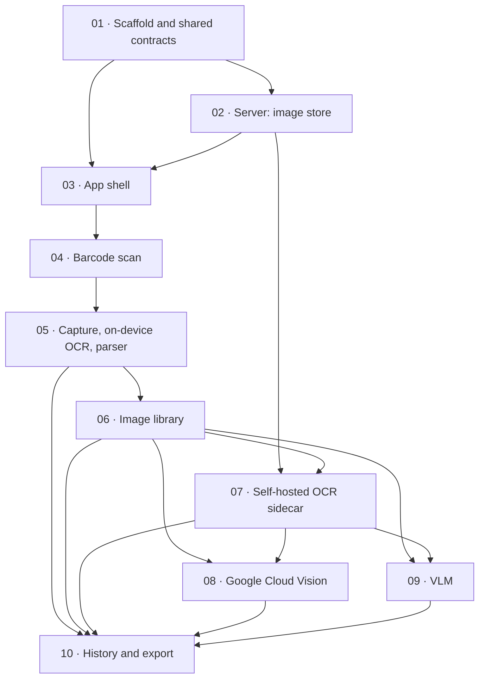

# Phases

The build order from [`../scanner-demo-claude-code-prompt.md`](../scanner-demo-claude-code-prompt.md),
expanded into one document per phase. Each is a separate commit, and **work stops after each one for
review** — that is a requirement of the specification, not a suggestion.

The specification is the source of truth. These documents do not restate it for its own sake; they collect
what is scattered across it (the screen section, the stack section, the API table, the gotchas) into one
checkable list per phase, and they name the judgement calls that had to be made to get there. Every such
call is recorded in [`../decisions.md`](../decisions.md).

Where the plan meets the real deployment box, it changed:
[`../deployment-target.md`](../deployment-target.md) records what is actually on that machine and which
assumptions it invalidated.

## How to read a phase document

Every one has the same sections, so they can be compared and so nothing quietly goes missing:

| Section | What it answers |
|---|---|
| **Goal** | What becomes possible after this phase, in one sentence |
| **Scope** | The numbered requirements, each traced to its section of the specification |
| **Out of scope** | What is deliberately *not* done here, and which phase does it |
| **Deliverables** | The files that appear or change |
| **Key decisions** | Links to the ADRs that govern this phase |
| **Interfaces** | The types, schemas and endpoints introduced |
| **Acceptance criteria** | Checkable statements — a command to run or a thing to observe |
| **Risks / unknowns** | What could invalidate the phase, and open questions for the owner |
| **Review checkpoint** | What to demonstrate at the stop |

## Order and dependencies

Phase 06 sits before the three engine phases on purpose: once a library of stored images exists, every
engine added afterwards is tested against images already collected instead of packaging being re-shot for
each one. Phase 07 precedes 08 and 09 because it introduces the `OcrEngine` interface they both implement.

| # | Phase | Status | Stop for review |
|---|---|---|---|
| [01](01-scaffold.md) | Scaffold and shared contracts | not started | Schemas, CI, secret hook |
| [02](02-server-images.md) | Server: image store, health, deployment | not started | Upload/serve/thumb over TLS |
| [03](03-app-shell.md) | App shell: dev build, navigation, Home | not started | Dev build on device, health indicator |
| [04](04-barcode.md) | Barcode scan screen | not started | Live decode + recorded latency |
| [05](05-capture-mlkit.md) | Expiry capture, on-device OCR, date parser | not started | Capture, two variants, parser tests |
| [06](06-library.md) | Image library | not started | Grid, filters, additive re-runs |
| [07](07-ocr-sidecar.md) | Self-hosted OCR sidecar | not started | **Two stops:** spike report, then build-out |
| [08](08-gcv.md) | Google Cloud Vision engine | not started | GCV over existing library images |
| [09](09-vlm.md) | VLM engine | not started | Model answer vs parser answer, provider swap |
| [10](10-history.md) | History and JSON export | not started | The POC's actual deliverable |

## Global constraints

These are settled and apply to every phase. They are listed here because a violation is most likely to
appear in a phase whose document does not mention them.

| Constraint | Where it is enforced |
|---|---|
| **TypeScript only. No Python anywhere**, including inside the OCR container | 07 — the container is a pre-built black box, used through configuration only |
| **Android only.** No iOS code paths, no Swift — but nothing hardcoded that makes iOS painful later | 03, and every app phase after it |
| **VLM provider is OpenAI, behind a swappable interface** | 09 |
| **The Hetzner box is CPU-only. Never install CUDA builds** | 07 — the only phase that brings an inference runtime onto the box |
| **The app holds zero provider credentials** | 03 (bearer only), 08, 09 (keys server-side), 01 (secret scanning) |
| **All code, comments, commit messages and docs in English** | every phase — the repository is public |
| **Durations use `performance.now()` / `process.hrtime.bigint()`, never `Date.now()`** | 01 — `packages/shared/src/timing.ts`, used by both sides; verified in 02, 04, 05, 07 |
| **No conversion of camera frames to Bitmap** | 04 and 05 — it applies to every camera path, not one screen |

## Coverage matrix

Every requirement in the specification, mapped to the phase that owns it. A requirement appearing in **no**
phase is a defect in this plan. A handful legitimately span phases — a constraint that applies to every
camera screen, or an API surface that is extended later — and those are listed with each owner and, where
they are constraints rather than work, repeated in the Global constraints table above.

### Repository and shared code

| Requirement (spec section) | Phase |
|---|---|
| pnpm workspace monorepo layout | [01](01-scaffold.md) |
| `packages/shared`: `OcrResponse` shape, zod schemas, one definition imported by both sides | [01](01-scaffold.md) |
| TypeScript strict mode everywhere | [01](01-scaffold.md) |
| Versioned price table ([ADR-11](../decisions.md#adr-11--cost-estimates-come-from-a-versioned-price-table)); real prices filled in by [08](08-gcv.md), [09](09-vlm.md) | [01](01-scaffold.md) |
| Shared monotonic timing helpers ([ADR-10](../decisions.md#adr-10--latency-segments-clocks-and-what-may-be-subtracted)) | [01](01-scaffold.md) |
| CI lint | [01](01-scaffold.md) |
| README, `.env.example` | [01](01-scaffold.md) |
| Pre-commit hook / CI check failing on staged secrets | [01](01-scaffold.md) |

### App

| Requirement | Phase |
|---|---|
| Expo development build (`expo prebuild` + EAS), not Expo Go | [03](03-app-shell.md) |
| Android-only build and test; no iOS configuration; `Platform` checks only | [03](03-app-shell.md) |
| React Navigation | [03](03-app-shell.md) |
| Home: navigation, server URL, health-check indicator | [03](03-app-shell.md) |
| Camera permission explicit, with recoverable denied state | [03](03-app-shell.md) |
| `react-native-vision-camera` v4 with `useCodeScanner`, EAN-13 only | [04](04-barcode.md) |
| No frame processors, no worklets | [04](04-barcode.md) |
| Camera session opens on mount, not on a button press | [04](04-barcode.md) |
| Continuous scanning, never unmount or restart between reads | [04](04-barcode.md) |
| 720p analysis stream | [04](04-barcode.md) |
| Torch toggle; haptic + short beep on decode | [04](04-barcode.md) |
| 800 ms dedupe | [04](04-barcode.md) |
| Result card: code + decode latency from screen-ready to callback | [04](04-barcode.md) |
| Barcode measurements persisted ([ADR-1](../decisions.md#adr-1--barcode-measurements-are-persisted-server-side)) | [04](04-barcode.md) |
| Capture screen is a different camera configuration; no shared component | [05](05-capture-mlkit.md) |
| Single `takePhoto()` at maximum resolution | [05](05-capture-mlkit.md) |
| Tap-to-focus with focus lock before the shutter | [05](05-capture-mlkit.md) |
| Torch defaults ON | [05](05-capture-mlkit.md) |
| On-screen framing guide | [05](05-capture-mlkit.md) |
| Photo uploaded immediately; not persisted on the phone beyond a cached thumbnail | [05](05-capture-mlkit.md) |
| "Import from gallery" via `expo-image-picker`, same upload-and-store path | [05](05-capture-mlkit.md) |
| Record `source` plus capture settings (resolution, torch, downscaling, dimensions, bytes) | [05](05-capture-mlkit.md) |
| Four separate method buttons, run one at a time; **no "run all" here** | [05](05-capture-mlkit.md) |
| `@react-native-ml-kit/text-recognition` on-device path | [05](05-capture-mlkit.md) |
| Result view: method, latency breakdown, raw text, parsed date or failure, confidence, cost | [05](05-capture-mlkit.md) |
| Library: thumbnail grid, newest first, paginated, server-side thumbnails | [06](06-library.md) |
| Library filters: source, date, has-been-run, date-extracted | [06](06-library.md) |
| Detail view: full image, capture metadata, every attempt, four method buttons | [06](06-library.md) |
| Re-running is additive; never overwrites | [06](06-library.md) |
| Attempts grouped by method with each run plus median latency | [06](06-library.md) |
| "Re-run all methods on this image" — the one place a batch action belongs | [06](06-library.md) |
| History: all attempts grouped by source image, filter by method | [10](10-history.md) |
| Export everything as JSON | [10](10-history.md) |
| History/Library must let camera and gallery results be filtered apart | [06](06-library.md), [10](10-history.md) |

### Server

| Requirement | Phase |
|---|---|
| Fastify, TypeScript strict, zod validation | [02](02-server-images.md) |
| SQLite via `better-sqlite3` with Drizzle | [02](02-server-images.md) |
| `sharp` for all decoding, resizing, normalisation; no pure-JS image libraries | [02](02-server-images.md) |
| Docker Compose, `node:22-slim` | [02](02-server-images.md) |
| Automatic TLS on `scanner.yo-po.eu` — **nginx vhost + certbot, not Caddy** ([ADR-17](../decisions.md#adr-17--nginx-and-certbot-instead-of-caddy)) | [02](02-server-images.md) |
| Bearer-token auth on everything except `/health` | [02](02-server-images.md) |
| Path constructed from image ID; client paths never reach a filesystem read; containment verified | [02](02-server-images.md) |
| Pre-built OCR sidecar (`rapidocr_api` default; not `paddlecloud/paddleocr`); pinned by digest | [07](07-ocr-sidecar.md) |
| Shared image directory volume, mounted read-only into the sidecar | [07](07-ocr-sidecar.md) (volume created in [02](02-server-images.md)) |
| Path where supported, upload where not — but the shared volume exists either way | [07](07-ocr-sidecar.md) |
| Control channel stays HTTP; no file-drop-and-poll; explicit timeout | [07](07-ocr-sidecar.md) |
| Sidecar on an internal-only network with no published ports | [07](07-ocr-sidecar.md) |
| UIDs aligned or volume group-readable | [07](07-ocr-sidecar.md) |
| In-process TypeScript ONNX OCR — explicitly *not now*, kept behind an interface | [07](07-ocr-sidecar.md) (out of scope) |
| `@google-cloud/vision`, `DOCUMENT_TEXT_DETECTION` | [08](08-gcv.md) |
| `openai` behind a `VlmProvider` interface, provider chosen by env var, one-file swap | [09](09-vlm.md) |
| `engine` records provider and model for the VLM path | [09](09-vlm.md) |
| GCV and VLM called only from the server, keys from environment | [08](08-gcv.md), [09](09-vlm.md) |

### Server API

| Endpoint | Phase |
|---|---|
| `POST /api/v1/images` | [02](02-server-images.md) |
| `GET /api/v1/images` (paginated, filterable) | [02](02-server-images.md) base, [06](06-library.md) filters |
| `GET /api/v1/images/:id` | [02](02-server-images.md) |
| `GET /api/v1/images/:id/thumb` | [02](02-server-images.md) |
| `GET /api/v1/health` | [02](02-server-images.md) |
| `POST /api/v1/attempts` | [05](05-capture-mlkit.md) |
| `GET /api/v1/images/:id/attempts` | [05](05-capture-mlkit.md) |
| `GET /api/v1/attempts` (filterable by method) | [10](10-history.md) |
| `POST /api/v1/ocr/local` | [07](07-ocr-sidecar.md) |
| `POST /api/v1/ocr/gcv` | [08](08-gcv.md) |
| `POST /api/v1/ocr/vlm` | [09](09-vlm.md) |
| `POST/GET /api/v1/barcode-scans` ([ADR-1](../decisions.md#adr-1--barcode-measurements-are-persisted-server-side)) | [04](04-barcode.md) |

### Date parsing

| Requirement | Phase |
|---|---|
| `packages/shared/src/dateParser.ts` with unit tests, imported by both sides | [05](05-capture-mlkit.md) |
| Methods 1–3 parsed by this one module, so accuracy differences are attributable to the OCR | [05](05-capture-mlkit.md) |
| Anchor list, including the Bulgarian phrases | [01](01-scaffold.md) (data), [05](05-capture-mlkit.md) (matching) |
| Format list (`DD.MM.YYYY` … `DD MMM YYYY`) | [05](05-capture-mlkit.md) |
| Disambiguation rules 1–4 | [05](05-capture-mlkit.md), governed by [ADR-6](../decisions.md#adr-6--parser-rule-order-and-referencedate)–[ADR-8](../decisions.md#adr-8--month-only-dates-resolve-to-the-last-day-with-a-precision-field) and [ADR-16](../decisions.md#adr-16--separators-and-year-widths-are-normalised-before-matching) |
| Every engine adapter returns `blocks: [{ text, bbox, confidence }]` | [05](05-capture-mlkit.md), [07](07-ocr-sidecar.md)–[09](09-vlm.md); nullability per [ADR-4](../decisions.md#adr-4--bbox-is-nullable-and-the-parser-records-which-rule-decided), [ADR-5](../decisions.md#adr-5--bbox-format-and-confidence-nullability) |
| Return a confidence score and always surface it; never silently guess | [05](05-capture-mlkit.md) |
| VLM returns both its structured answer and its raw text; record both, and parse the raw text too | [09](09-vlm.md) |

### Gotchas

All ten, each with an owner.

| # | Gotcha | Phase |
|---|---|---|
| 1 | ML Kit v2 does not support Cyrillic; note it in the README as a known limitation | [05](05-capture-mlkit.md); recorded in [README](../../README.md) |
| 2 | Don't convert camera frames to Bitmap anywhere | [04](04-barcode.md), [05](05-capture-mlkit.md) |
| 3 | Camera permission explicit, recoverable denied state | [03](03-app-shell.md) |
| 4 | Warm the sidecar at startup; report cold start separately; `engineMs` is steady state | [07](07-ocr-sidecar.md) |
| 5 | Constrain sidecar CPU and threads explicitly | [07](07-ocr-sidecar.md) |
| 6 | Prefer mobile/lightweight PP-OCR models over server ones | [07](07-ocr-sidecar.md) |
| 7 | Default models are Chinese + English; Cyrillic needs an explicit model choice, noted in the README | [07](07-ocr-sidecar.md), [ADR-12](../decisions.md#adr-12--the-self-hosted-engine-defaults-to-chineseenglish-models) |
| 8 | Measure the sidecar boundary separately from the engine | [07](07-ocr-sidecar.md) |
| 9 | `process.hrtime.bigint()` / `performance.now()`, never `Date.now()` | [01](01-scaffold.md) — `packages/shared/src/timing.ts`; verified in [02](02-server-images.md), [04](04-barcode.md), [05](05-capture-mlkit.md), [07](07-ocr-sidecar.md) |
| 10 | Downscale and re-encode on the phone before upload (~1600px, q80), configurable | [05](05-capture-mlkit.md) |

## Open questions blocking execution

Not blocking this plan, but blocking the phases they belong to.

| Question | Blocks | Status |
|---|---|---|
| `scanner.yo-po.eu` must resolve to `167.235.146.155` before certbot can issue a certificate — an `A` record at the registrar. | [02](02-server-images.md) | **open** |
| Local `expo run:android` (needs the Android SDK here) or EAS cloud builds (needs an Expo account)? No device is currently attached. | [03](03-app-shell.md) | **open** |
| SSH access to the deployment box, and who deploys. | [02](02-server-images.md) | resolved 2026-07-28 — see [deployment-target.md](../deployment-target.md) |
